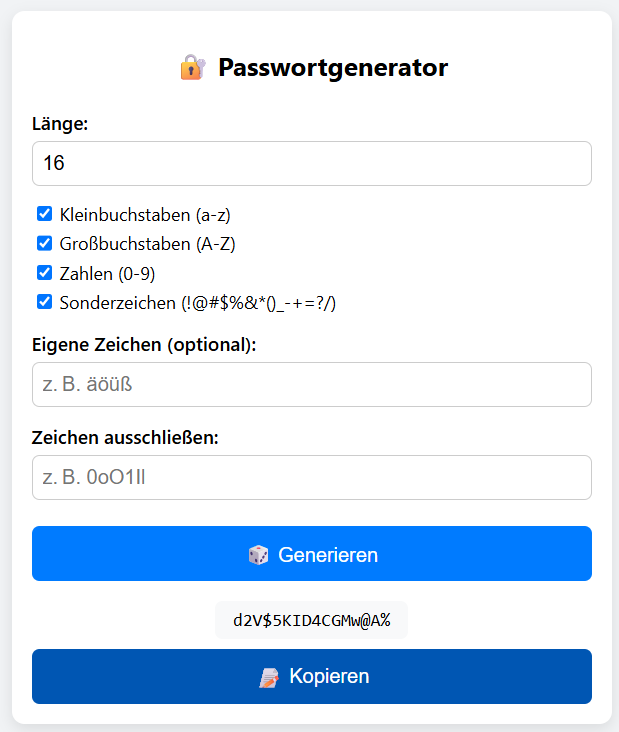

# 🔐 Passwortgenerator – Mobilfreundlich & Modern

Ein moderner, responsiver Passwortgenerator mit vielen Optionen – direkt im Browser nutzbar, ohne Backend oder Tracking.

---

## ✨ Features

- ✅ Wähle Passwortlänge (4–64 Zeichen)
- ✅ Wähle Zeichentypen: Kleinbuchstaben, Großbuchstaben, Zahlen, Sonderzeichen
- ✅ Eigene Zeichen hinzufügen
- ✅ Beliebige Zeichen ausschließen (z. B. 0, O, l, I)
- ✅ Sicher: `crypto.getRandomValues()` für echte Zufälligkeit
- ✅ Mobilfreundlich
- ✅ Copy-to-Clipboard
